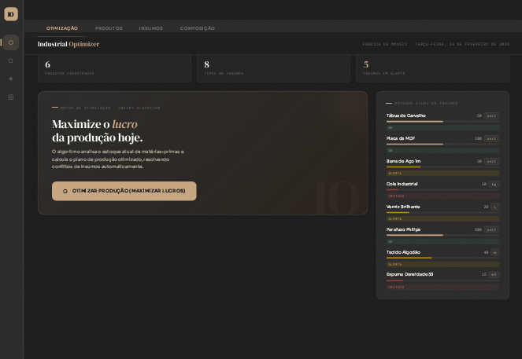
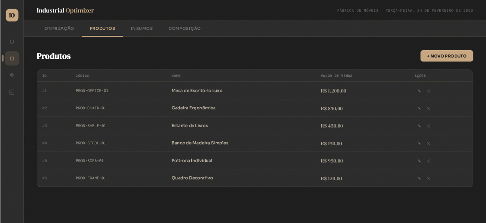
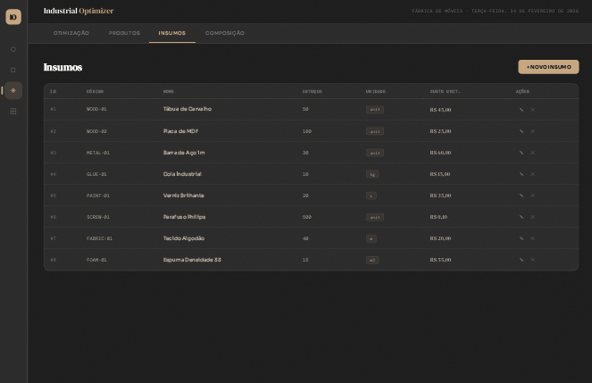
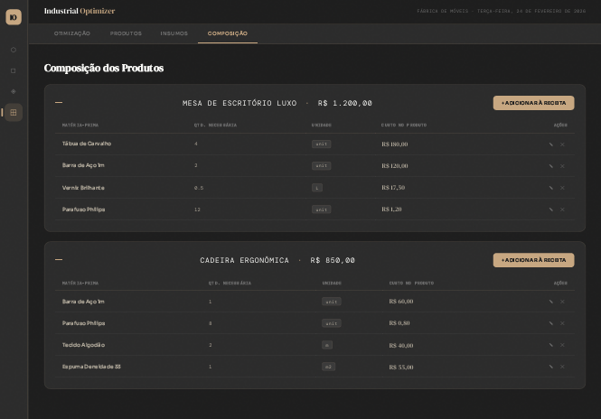

# Industrial Production Optimizer

[🌎 English](./README.md) | 🇧🇷 Português

Playground de planejamento de produção para uma fábrica de móveis.  
Este projeto demonstra como maximizar o lucro dado um estoque limitado de matérias-primas usando um algoritmo de otimização gulosa, implementado com **Spring Boot** e **Vue 3**.

---

## 📖 Visão Geral

O Industrial Optimizer é um desafio técnico full-stack que simula uma fábrica de móveis:

* **Backend (Spring Boot)**
  * Expõe endpoints REST para Produtos, Matérias-Primas e Composições de Produtos.
  * Implementa um **serviço de otimização gulosa** que sugere quantas unidades de cada produto devem ser produzidas para maximizar o lucro, dado o estoque atual de matérias-primas.
* **Frontend (Vue 3 + Vite)**
  * Um dashboard de página única com:
    * CTA de otimização + destaque do lucro total.
    * Cards do plano de produção (o que produzir e por quê).
    * Visualização do consumo de estoque e alertas de escassez.
    * Telas de CRUD para Produtos, Matérias-Primas e Receitas (composições).

A lógica de otimização foi projetada para ser fácil de entender durante uma revisão de código, ao mesmo tempo que é realista o suficiente para exercitar modelagem de domínio, design de schema SQL e integração API/frontend.

A documentação detalhada está em [`/docs`](./docs).

---

## 🖼️ Screenshots

| Otimização | Produtos |
|---|---|
|  |  |

| Insumos | Composição |
|---|---|
|  |  |

---

## ⚙️ Pré-requisitos

Certifique-se de que sua máquina possui:
* **Java 17 ou 21** (Qualquer distribuição recente está ok, Temurin / OpenJDK recomendado)
* **Node.js 18+** e **npm**
* **Git** (para clonar o repositório)

---

## 📂 Estrutura do Projeto

```text
industrial-optimizer/
├── backend/                        # Aplicação Spring Boot (REST API + otimizador)
├── frontend/                       # SPA Vue 3 + Vite (dashboard e CRUD)
├── database/                       # schema.sql e seed.sql
├── docs/                           # Docs de arquitetura, algoritmo, testes e validação
├── init-structure.sh               # Script auxiliar Unix/macOS para iniciar tudo
├── init-structure.ps1              # Script auxiliar Windows para iniciar tudo
├── test-validation-scenarios.ps1   # Script Windows para testes automatizados de validação de API
└── README.md                       # Arquivo principal (inglês)
```

---

## 🚀 Como Executar

Você pode usar os scripts de automação (recomendado para revisores) ou os comandos manuais.

### 1. Clonar o repositório

```bash
git clone https://github.com/<seu-usuario>/industrial-optimizer.git
cd industrial-optimizer
```

### 2. Inicialização automática (Scripts)

Os scripts fornecidos instalam as dependências automaticamente, iniciam o backend Spring Boot na porta 8080 e sobem o servidor de desenvolvimento Vue 3 na porta 5173.

**No Windows (PowerShell):**

```powershell
.\init-structure.ps1
```

**No Unix/macOS:**

```bash
chmod +x init-structure.sh
./init-structure.sh
```

### 3. Execução Manual (Se preferir controle total)

**Backend (Spring Boot):**

```bash
cd backend
./mvnw spring-boot:run  # No Windows use: .\mvnw.cmd spring-boot:run
```

**Frontend (Vue 3 + Vite):**

```bash
cd frontend
npm install
npm run dev
```

---

## 🧪 Como Testar

Esta seção cobre os comandos para executar os testes e o fluxo passo a passo descrevendo como os testes validam o sistema.

### 1. Comandos

**Testes Unitários e de Integração do Backend (Spring Boot):**

```bash
cd backend
./mvnw test  # No Windows use: .\mvnw.cmd test
```

**Cenários de Validação do Backend (Script Automatizado):**  
Certifique-se de que o backend está em execução antes de rodar este script.

```powershell
.\test-validation-scenarios.ps1
```

**Testes do Frontend (Vitest + Vue Test Utils):**

```bash
cd frontend
npm install
npm run test:unit
```

### 2. Fluxo de Testes (Passo a Passo)

#### 2.1 Fluxo de Testes do Backend

* **Validação de Domínio e Schema:** Os testes garantem que o relacionamento N:M (Produto × Matéria-Prima via ProductComposition) corresponde ao modelo de negócio e ao schema SQL pretendidos.
* **Testes do Serviço de Otimização:** Testes unitários focam no `ProductionOptimizerService`. Com um estoque e catálogo de produtos pré-carregados, valida se o serviço ordena os produtos por rentabilidade, respeita as restrições de matéria-prima e trata casos extremos (esgotamento de estoque, produtos com lucro zero).
* **Sanidade do Contrato de API:** Testes para os controllers verificam se `/api/products`, `/api/raw-materials` e `/api/product-compositions` retornam os códigos de status HTTP corretos (200/201/204) e a serialização correta dos DTOs.

#### 2.2 Fluxo de Testes do Frontend

* **Estado de Carregamento & UX:** Verifica que clicar no CTA de otimização desabilita o botão e exibe um estado de carregamento, evitando cliques duplos.
* **Formatação:** Garante que o lucro total projetado é renderizado corretamente em moeda BRL.
* **Feedback de Erro:** Simula um erro 500 da API para validar que o componente exibe uma mensagem de erro clara e amigável na interface.
* **Mock de API:** Usa `vi.mock` para simular os endpoints (`getMaterials`, `getProducts`, `getOptimization`) e focar estritamente no comportamento da UI e reatividade sem precisar de um backend ativo.

---

## 📚 Mapa de Documentação

Para se aprofundar em partes específicas da solução:

| Documento | Caminho |
|---|---|
| Arquitetura & Engenharia do Backend | `docs/backend/backend_engineering.md` |
| Arquitetura & UX do Frontend | `docs/frontend/Documentacao_frontend.md` |
| Algoritmo & Lógica da Solução | `docs/architecture/solution-logic.md` |
| Integridade de Dados & Cenários de Validação | `docs/validation/VALIDATION_AND_INTEGRITY_GUIDE.md` |
| Índice Completo de Arquivos | `docs/meta/FILE_INDEX.md` |